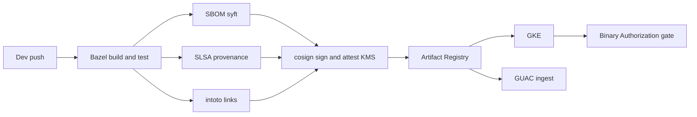
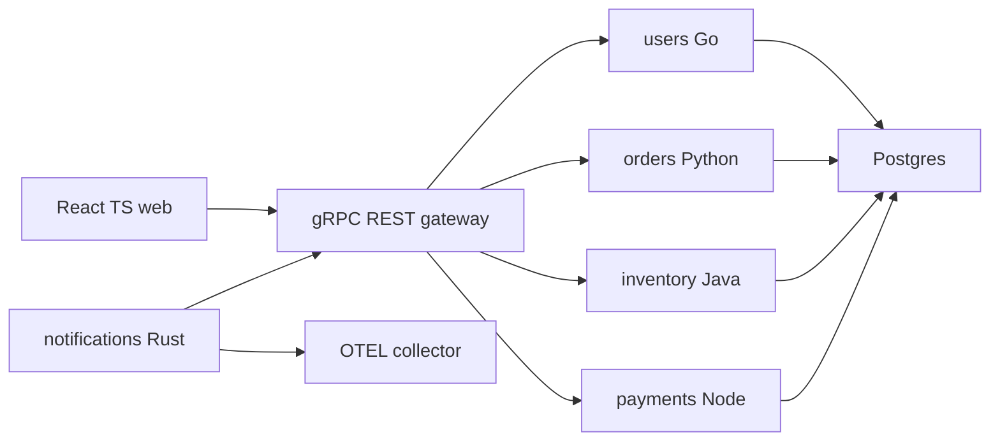
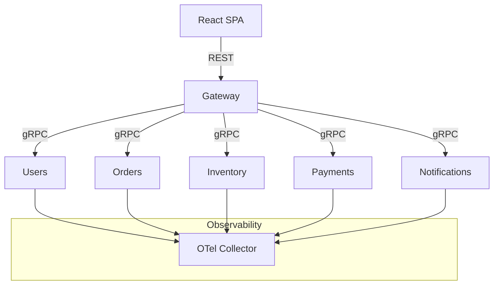

# slsa-bazel-gke-reference

> End-to-end **secure software supply chain** on Google Cloud with **Bazel**, **SLSA L3 provenance**, **SBOMs**, **cosign + KMS**, **Binary Authorization** gates on **GKE**, **in-toto** attestations, **GUAC** supply-chain graphing, **OPA Gatekeeper** policies, **OpenTelemetry** observability, and a **polyglot microservices** app (Go, Python, Java, Node, Rust) + React web UI.


---

## Why this repo exists

Modern teams need verifiable builds, signed artifacts, and policy-gated deploys. This repo is a **working reference** that shows the full path:

**Bazel build → unit/e2e tests → SBOMs (CycloneDX/SPDX) → SLSA provenance → cosign KMS signatures & in-toto attestations → Artifact Registry → Binary Authorization gate on GKE → GUAC ingestion & querying**, with great local dev ergonomics (docker-compose, kind + skaffold) and proper docs/tests.

---

## High-level architecture





---

## What’s inside

- **Polyglot microservices:** Go (gRPC+REST), Python (FastAPI), Java (Spring Boot), Node (Express), Rust (Actix) + **React/TS** web.
- **Bazel monorepo:** unified toolchains, tests, container builds.
- **Supply chain:** syft SBOMs, SLSA provenance, in-toto, cosign w/ **Cloud KMS**.
- **Policy:** **Binary Authorization** & **Continuous Validation**, **OPA Gatekeeper** constraints.
- **Infra:** **Terraform** for GCP (Artifact Registry, KMS, GKE, Workload Identity, Cloud Build triggers, Secret Manager, Binauthz).
- **Observability:** **OpenTelemetry** across services + Collector.
- **GUAC:** cluster-deployed; query SBOMs/attestations.
- **Dev UX:** docker-compose, kind + local registry, **skaffold** inner loop, VS Code devcontainer.
- **Tests:** per-service unit tests + top-level **e2e** (“create user → create order → adjust inventory → payment → notification”).

---

## Quickstarts

### 1) Local (docker-compose)
```bash
make compose-up
# Web at http://localhost:3000 ; services expose /healthz and /readyz
bazel test //...
make compose-down
```

### 2) Inner loop (kind + skaffold)
```bash
make kind-up           # creates kind cluster w/ local registry mirror
skaffold dev           # live-reloads all services
# In another terminal:
make migrate           # run DB migrations
make seed              # load demo data and trigger one end-to-end flow
make kind-down
```

### 3) Google Cloud deploy (Terraform + Cloud Build + Binauthz)
```bash
gcloud auth application-default login
terraform -chdir=infra/terraform init
terraform -chdir=infra/terraform apply   # creates AR, KMS, GKE, SA/IAM, Binauthz attestor, etc.

# Build & sign a service image via Cloud Build (example: users)
gcloud builds submit --config=ci/cloudbuild/services/users.yaml \
  --substitutions=_PROJECT_ID=$(gcloud config get-value project),_REGION=us-central1

# Apply Binary Authorization policy & Continuous Validation on cluster:
kubectl apply -f infra/binauthz/policy.yaml
kubectl apply -f infra/binauthz/continuous-validation.yaml

# Deploy app (Helm umbrella)
helm upgrade --install app infra/helm/umbrella -n app --create-namespace
```

> **Cost note:** GCP resources incur cost. `terraform destroy` cleans them up.

---

## Verifying supply chain

```bash
# Generate SBOM locally for an image
make sbom IMAGE=us-central1-docker.pkg.dev/$PROJECT/app/users:$(git rev-parse --short HEAD)

# Verify signature + SLSA provenance
make verify IMAGE=us-central1-docker.pkg.dev/$PROJECT/app/users:$(git rev-parse --short HEAD)
```

- **Binary Authorization** enforces: only **signed** images with **valid SLSA provenance** can run on GKE.

---

## GUAC visibility

```bash
# Deploy GUAC (if not already):
helm upgrade --install guac infra/helm/guac -n guac --create-namespace

# Example query via helper tool:
go run ./tools/guacctl list-images-with 'pkg:openssl'
```

---

## Policies with OPA Gatekeeper

- Disallow `:latest`
- Require CPU/Memory requests & limits
- Restrict registries to Artifact Registry
- Mandatory labels
```bash
kubectl apply -k infra/opa-gatekeeper   # templates + constraints
```

---

## Project layout (abridged)
```
apps/web/                # React/TS frontend
api/proto/               # Protobufs; Go stubs for gateway
api/gateway/             # REST↔gRPC bridge (Go)
services/{users,orders,inventory,payments,notifications}/
infra/terraform/         # GCP infra (AR, KMS, GKE, Binauthz, CB triggers)
infra/helm/umbrella/     # Helm umbrella chart (+ subcharts)
infra/k8s/               # Kustomize overlays (dev/prod)
infra/otel/              # OTEL Collector config
infra/opa-gatekeeper/    # Gatekeeper CTs + constraints
infra/binauthz/          # Binauthz policy + CV
ci/cloudbuild/           # Cloud Build pipelines
.github/workflows/       # CI for PRs (unit + e2e, build/lint)
supply-chain/{sbom,intoto,slsa,cosign}/
tests/e2e/               # end-to-end tests
```

---

## Make targets

```
compose-up / compose-down
kind-up / kind-down
skaffold-dev
migrate / seed
sbom IMAGE=...
sign IMAGE=...
verify IMAGE=...
e2e
fmt / lint
```

---

## Prereqs

- macOS/Linux: Docker, Bazelisk, Terraform, gcloud, kubectl, helm, kind, skaffold, cosign, syft, jq, Go ≥1.21, Node ≥18, Python ≥3.10, Java 17, Rust stable.

---

## Troubleshooting

- **Binauthz deny:** run `make verify` for the image; check attestor name & key URI; ensure Cloud Build used the KMS signer.
- **GUAC shows nothing:** confirm SBOM upload path and ingestor settings; rebuild an image and re-deploy.
- **kind DNS / pull errors:** confirm local registry mirror + image rewrite; `skaffold dev -v debug` to inspect.
- **SBOM size/timeouts:** prefer CycloneDX JSON, scope to runtime packages.
- **CI flake:** run `bazel test //...` locally; ensure service ports/health checks match manifests.

---

## Contributing

PRs welcome! Please run `bazel test //...` and `make e2e` before pushing.

---

## License

[Apache-2.0](./LICENSE)

---

> **Replace `OWNER` in the CI badge URL with your GitHub handle or org.**

---

## 60-second Quickstart

```bash
python -m venv .venv
source .venv/bin/activate
pip install -r requirements-dev.txt
scripts/demo.sh
```

---

## Demo

Run the recruiter-friendly local demo (starts an in-memory gateway, exercises user/order/inventory flow, and prints a report preview):

```bash
scripts/demo.sh
```

---

## Verification

Use the single-source verification script (lint + compile + tests + demo smoke):

```bash
scripts/verify.sh
```

---

## Features

- Local demo gateway with `/healthz`, `/readyz`, and core `/v1/*` endpoints for users, orders, inventory, metrics, traces, and reports.
- Policy safety layer (opt-in via `DEMO_POLICY=1`) to gate users/orders with risk classification.
- Structured logging and timing metrics with optional JSON output (`LOG_FORMAT=json`).
- Trace recorder with deterministic markdown/JSON exports (`DEMO_TRACE=1`).

---

## Project structure

```
src/app/lib/packages/supply_chain_demo/   # demo gateway + policy + trace + report toolkit
scripts/demo.sh                           # one-command demo
scripts/verify.sh                         # deterministic verification
scripts/doctor.sh                         # environment diagnostics
```

---

## Design decisions

- Keep the demo gateway in-process and dependency-free (stdlib only) for deterministic, offline-safe tests.
- Make safety and observability features opt-in to avoid changing default behavior.
- Provide a single verification entrypoint to keep CI consistent and easy to run locally.
