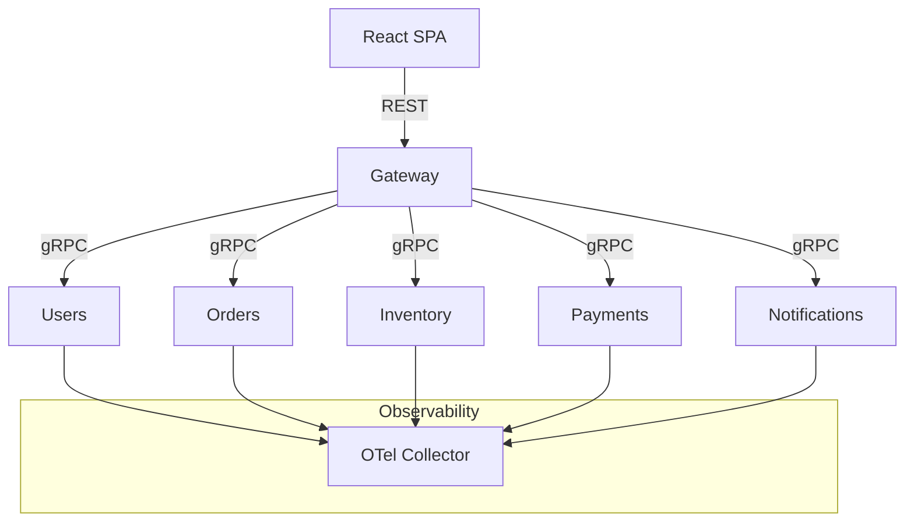

# Architecture Overview

The platform uses Bazel as the build orchestrator, producing container images for each microservice. A Go-based gRPC-Gateway serves as the northbound REST interface for the React single page application. Services exchange protobuf messages defined in `api/proto` and communicate with a shared Postgres database managed per service schema. OpenTelemetry traces and metrics flow to a collector that can export to stdout or Prometheus during local development.
