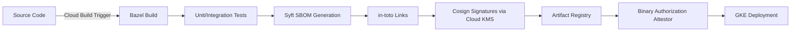

# SLSA Provenance and Binary Authorization

This guide explains how the repository achieves Supply-chain Levels for Software Artifacts (SLSA) level 3 provenance and how Google Cloud Binary Authorization enforces that provenance before workloads are admitted to the cluster.

## Overview

The secure build pipeline is implemented in `ci/cloudbuild/build-all.yaml`. It drives Bazel builds, generates SBOMs with Syft, produces in-toto link metadata, and signs container images plus attestations with cosign using a Cloud KMS-backed key. The resulting provenance is stored alongside the container image in Artifact Registry and registered with Binary Authorization.



## Cloud Build provenance

The `build-all.yaml` workflow executes the following provenance-related steps:

1. `bazel build //...` with reproducible flags so artifacts are deterministic.
2. `./scripts/generate-provenance.sh` uses `gcloud artifacts packages describe` and `cosign attest` to create SLSA provenance attestations referencing the build.
3. `./scripts/generate-sbom.sh` runs Syft twice (CycloneDX and SPDX) and uploads the results to Cloud Storage for GUAC ingestion.
4. in-toto metadata is produced via `in-toto-run`, capturing the build command, environment, and materials.
5. `cosign sign --key ${KMS_KEY}` signs both the container image and the generated attestations.

All generated artifacts are stored in `${_ATTESTATION_BUCKET}` with an index file for GUAC ingestion.

## Binary Authorization

Binary Authorization is provisioned by Terraform under `infra/terraform/modules/binary_authorization`. The module creates:

- An attestor bound to the KMS key used by Cloud Build.
- Policy rules that require matching provenance predicate type `https://slsa.dev/provenance/v1`.
- Continuous Validation that scans Artifact Registry images and marks non-compliant artifacts.

The policy enforces the following:

- Only images originating from the designated Artifact Registry repository may run.
- Images must carry a cosign signature verified by the attestor.
- Images must include a SLSA predicate referencing the Cloud Build builder ID.

### Manual verification

Before deploying a new release you can verify the provenance locally:

```bash
./scripts/verify-attestations.sh \
  --image "${REGION}-docker.pkg.dev/${PROJECT_ID}/${REPO}/gateway:${TAG}" \
  --kms-key "${KMS_KEY}" \
  --attestor "projects/${PROJECT_ID}/attestors/slsa-attestor"
```

The script downloads the provenance, validates the signature, and checks that the build command references Bazel targets.

## Updating policies

If you need to permit an additional predicate (for example SPDX SBOM attestations), extend the constraint section in `infra/terraform/modules/binary_authorization/main.tf` and apply Terraform. The new policy will be propagated to the cluster automatically.

See also `docs/04-sbom-and-guac.md` for the SBOM specifics.
